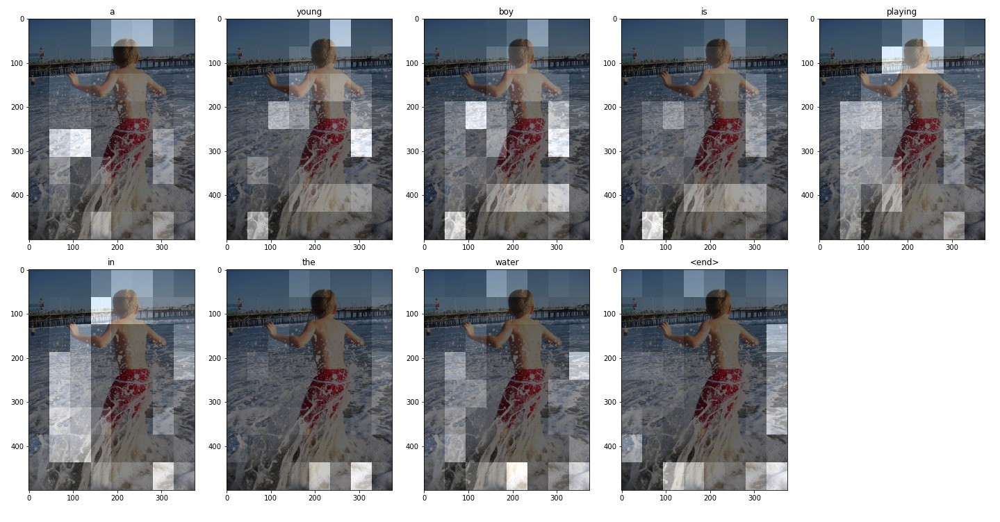

## Image Caption Generator

### Introduction

The aim of this project is to create an Image Captioning System using Attention Mechanism. The trained model takes an image as input and outputs a sentence description that is both accurate and semantically (or grammatically) apt.

*For a demonstration of model's performance, head over to the notebook "05-model-prediction.ipynb" which has a number of worked out examples.*

This project is still in progress. The key achievments so far are as follows:

1. Implemented Attention

2. Used BLEU Score for evaluating model performance

3. Implemented Beam Search Algorithm for improved caption quality

4. Used pretraining GloVe word vector and reduced training time by 50%

5. Trained on a dataset of 150k image-caption pairs using Flickr30k dataset

----------
### Model Performance

Attention mechanism, intuitively, allows the model to perceive images close to the way humans perceive them, by focusing more on certain areas of the image at a time. This in turn helps us to visualize what the model sees for predicting each word. Here is an example of an attention plot.   

   

*To see more attention plots and predicted captions, head over to the notebook "05-model-prediction.ipynb".*

The best evaluation scores achieved so far are :   
- BLEU-1: 86.87% 
- BLEU-2: 77.00%
- BLEU-3: 64.8%
- BLEU-4: 9.03%

There is still a lot of scope for improvement in the model.

----------
### Setup
To run the model against images of your choice, follow the steps below:
1. Install Python 3 using Anaconda or any other method.
2. Follow the steps on [this](https://www.tensorflow.org/install/gpu#linux_setup) page to install the prerequisites for TensorFlow.
3. Install the Python requirements with `pip install -r requirements.txt`
4. Open the notebook "05-model-prediction.ipynb" and run the cells sequentially. Replace the `image` variable with the path to your image

For any suggestions, comments or anything else, you can find me at my [Mail](mailto:shailesh1121998@gmail.com?subject=[GitHub]%20Image%20Captioning%20Using%Attention) or [LinkedIn](https://www.linkedin.com/in/shailesh-mahto).

----------
### References
- https://www.coursera.org/learn/nlp-sequence-models

- https://www.tensorflow.org/tutorials/text/image_captioning

- https://nlp.stanford.edu/projects/glove/

- http://shannon.cs.illinois.edu/DenotationGraph/

- https://machinelearningmastery.com/prepare-photo-caption-dataset-training-deep-learning-model/

- https://forms.illinois.edu/sec/1713398/
- http://images.cocodataset.org/annotations/annotations_trainval2014.zip