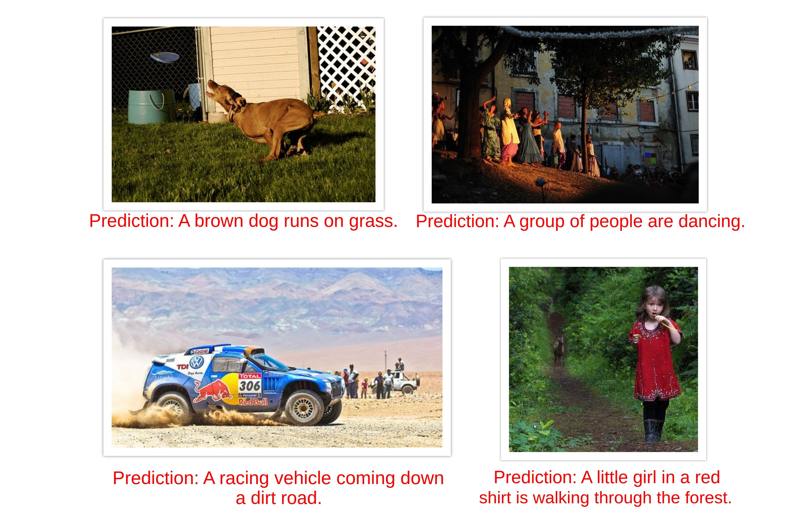
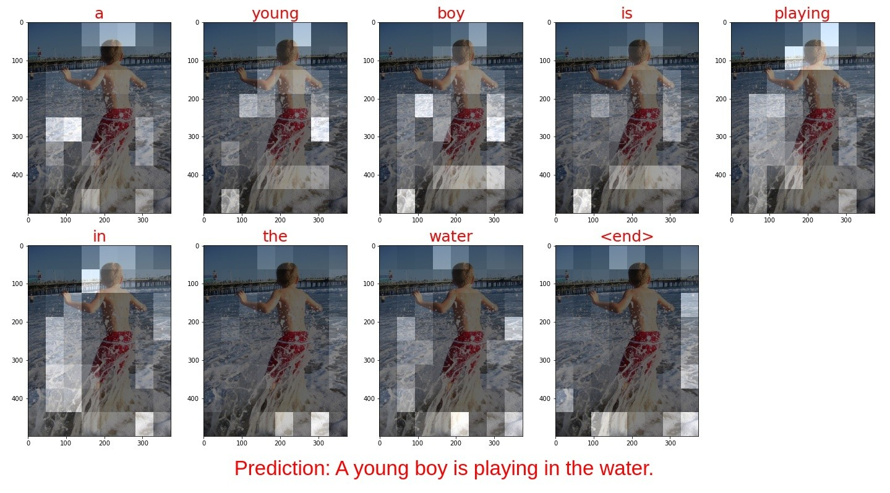
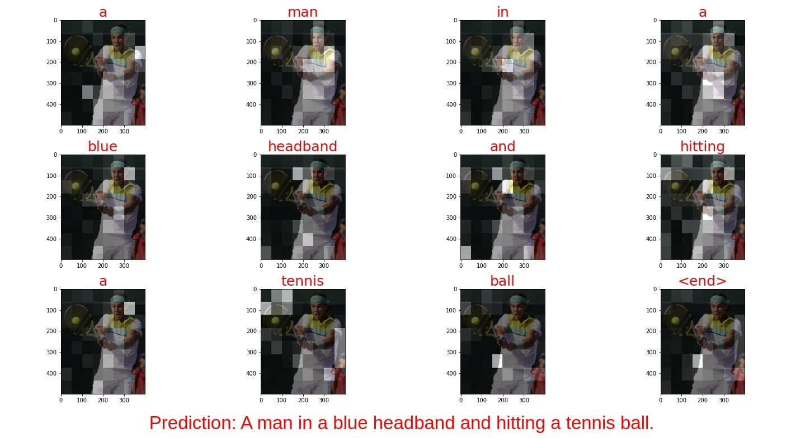

## Image Caption Generator

### Introduction

The aim of this project is to create an Image Captioning System using Attention Mechanism. The trained model takes an image as input and outputs a sentence description that is both accurate and semantically (or grammatically) apt.  
Model prediction on a few images is as follows:

*To see model prediction on more images, head over to the notebook "[05-model-prediction.ipynb](./05-model-prediction.ipynb/)".*

----------
### Model
This project is still in progress. The key achievments so far are as follows:

- **Implemented Attention**: Attention mechanism, intuitively, allows the model to perceive images close to the way humans perceive them, by focusing more on certain areas of the image at a time. This in turn helps us to visualize what the model sees for predicting each word as shown below.   

 

*To see more attention plots and model predictions, head over to the notebook "[05-model-prediction.ipynb](./05-model-prediction.ipynb/)".*

- Implemented **Beam Search Algorithm** for improved caption quality

- Used pretraining **GloVe word vector** reducing the number of trainable parameters by 2.4M and training time by 50%

- Trained on a dataset of **150k image-caption pairs** using Flickr30k dataset

- Used **BLEU Score** for evaluating model performance:  
The best evaluation scores achieved so far are:
    - BLEU-1: 86.87% 
    - BLEU-2: 77.00%
    - BLEU-3: 64.8%
    - BLEU-4: 9.03%   

----------
### Setup
To run the model against images of your choice, follow the steps below:
1. Install Python 3 from [here](https://www.python.org/downloads/) (preferrably v3.7.6, but not mandatorily).
2. Create a virtual environment using [these](https://packaging.python.org/guides/installing-using-pip-and-virtual-environments/#creating-a-virtual-environment) steps.
3. Activate the virtual environment using [these](https://packaging.python.org/guides/installing-using-pip-and-virtual-environments/#activating-a-virtual-environment) steps. 
4. Download this repository and navigate to the downloaded woking directory in your terminal.
3. Install the Python requirements with `pip install -r requirements.txt`.
4. Run Jupyter notebook using command `jupyter notebook`.
4. Open the notebook "[05-model-prediction.ipynb](./05-model-prediction.ipynb/)" and run the cells sequentially. Replace the `image` variable with the path to your image.

For any suggestions, comments or anything else, you can find me at my [Mail](mailto:shailesh.formal@gmail.com?subject=[GitHub]%20Image%20Captioning%20Using%Attention) or [LinkedIn](https://www.linkedin.com/in/shailesh-mahto).

----------
### TODO
- [X] Attention Mechanism
- [X] Beam Search Algorithm
- [X] BLEU Score
- [X] Use pretrained word embeddings
- [ ] Train on MSCOCO dataset with 414k image-caption pairs
- [ ] Create an API and develop a web app
- [ ] Deploy the model

----------
### References
- https://www.coursera.org/learn/nlp-sequence-models

- https://www.tensorflow.org/tutorials/text/image_captioning

- https://nlp.stanford.edu/projects/glove/

- http://shannon.cs.illinois.edu/DenotationGraph/

- https://machinelearningmastery.com/prepare-photo-caption-dataset-training-deep-learning-model/

- https://forms.illinois.edu/sec/1713398/
- http://images.cocodataset.org/annotations/annotations_trainval2014.zip